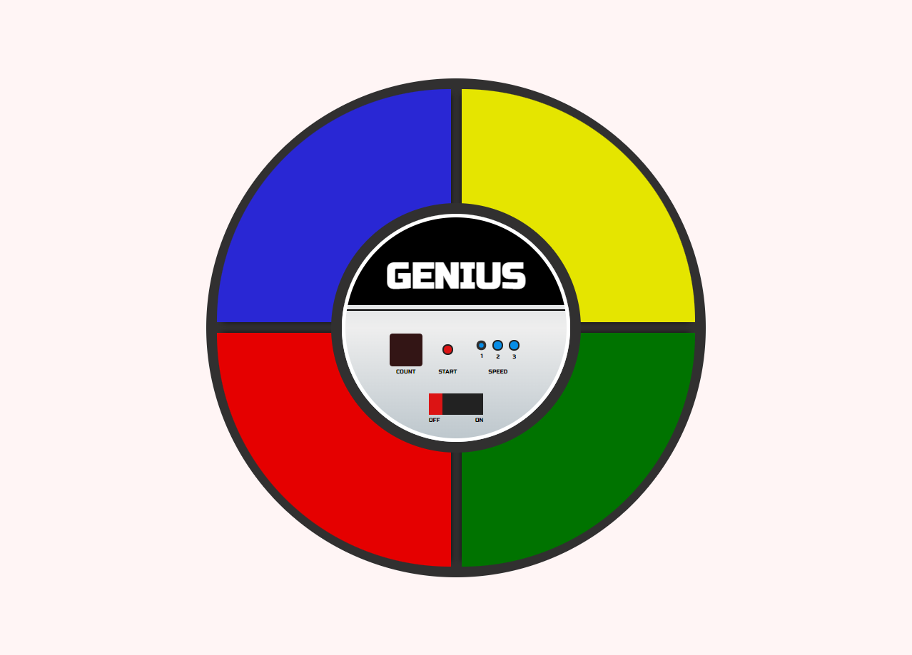

<!-- TITLE -->
<h1>GENIUS GAME</h1> <br>
<!-- PROJECT LOGO -->
<div align="center">
 
Project developed at the "<a href="https://web.dio.me/">Digital Innovation One</a> - Eduzz Fullstack Developer #2"  event. 
<div id="top"></div>
</div><br>  

<!-- 
[![Contributors][contributors-shield]][contributors-url]
[![Forks][forks-shield]][forks-url]
[![Stargazers][stars-shield]][stars-url]
[![Issues][issues-shield]][issues-url] 
-->
[![MIT License][license-shield]](https://github.com/MarioDoncel/GeniusGame/blob/main/LICENSE)
[![LinkedIn][linkedin-shield]](https://www.linkedin.com/in/marioadoncel/)


<br />


<!-- TABLE OF CONTENTS -->
<details>
  <summary>Table of Contents</summary>
  <ol>
    <li>
      <a href="#about-the-project">About The Project</a>
      <ul>
        <li><a href="#built-with">Built With</a></li>
        <li><a href="#objective">Objective</a></li>
        <li><a href="#status">Status</a></li>
      </ul>
    </li>
    <li>
      <a href="#getting-started">Getting Started</a>
      <ul>
        <li><a href="#prerequisites">Prerequisites</a></li>
        <li><a href="#installation">Installation</a></li>
      </ul>
    </li>
    <li><a href="#usage">Usage</a></li>
    <li><a href="#license">License</a></li>
    <li><a href="#contact">Contact</a></li>
    <li><a href="#acknowledgments">Acknowledgments</a></li>
  </ol>
</details>


<!-- ABOUT THE PROJECT -->
## About The Project
Simple game Genius made just to accomplish a task on bootcamp. I took a different coding strategy from the intructor and also took the opportunity to practice the basics of 
Typescript.

<p align="right">(<a href="#top">back to top</a>)</p>


### Built With

<!-- This section should list any major frameworks/libraries used to bootstrap your project. Leave any add-ons/plugins for the acknowledgements section. Here are a few 
examples. -->
* HTML
* CSS
* Javascript
* [Typescript](https://www.typescriptlang.org/)
<!-- 
* [Next.js](https://nextjs.org/)
* [React.js](https://reactjs.org/)
* [Vue.js](https://vuejs.org/)
* [Angular](https://angular.io/)
* [Svelte](https://svelte.dev/)
* [Laravel](https://laravel.com)
* [Bootstrap](https://getbootstrap.com)
* [JQuery](https://jquery.com)
 -->
<p align="right">(<a href="#top">back to top</a>)</p>

### Objective

Project developed just for educacional purposes.
<p align="right">(<a href="#top">back to top</a>)</p>

### Status

Finished.
<p align="right">(<a href="#top">back to top</a>)</p>

<!-- GETTING STARTED -->
## Getting Started

### Prerequisites

<!-- This is an example of how to list things you need to use the software and how to install them. -->
* npm
  ```sh
  npm install npm@latest -g
  ```

### Installation

<!-- _Below is an example of how you can instruct your audience on installing and setting up your app. This template doesn't rely on any external dependencies or services._
 -->
<!-- 1. Get a free API Key at [https://example.com](https://example.com) -->
1. Clone the repo
   ```sh
   git clone https://github.com/MarioDoncel/GeniusGame
   ```
2. Open index.html with live server

or 

1. Open it on the link bellow

  <a href="https://mariodoncel.github.io/GeniusGame/"> GENIUS GAME </a>

<p align="right">(<a href="#top">back to top</a>)</p>


<!-- USAGE EXAMPLES -->
## Usage

* **Single Page** - A page where you can play the game.


<p align="right">(<a href="#top">back to top</a>)</p>


<!-- LICENSE -->
## License

Distributed under the MIT License. See `LICENSE.txt` for more information.

<p align="right">(<a href="#top">back to top</a>)</p>


<!-- CONTACT -->
## Contact

Mario Andres Doncel Neto  

Email - 88mario.doncel@gmail.com <br>
Whatsapp - +55 19 99612 9909

Project Link: [https://github.com/MarioDoncel/GeniusGame](https://github.com/MarioDoncel/GeniusGame)

<p align="right">(<a href="#top">back to top</a>)</p>


<!-- ACKNOWLEDGMENTS -->
## Acknowledgments

* [DIGITAL INNOVATION ONE](https://web.dio.me/)
* [EDUZZ](https://www.eduzz.com/)

<p align="right">(<a href="#top">back to top</a>)</p>


<!-- MARKDOWN LINKS & IMAGES -->
<!-- https://www.markdownguide.org/basic-syntax/#reference-style-links -->
[contributors-shield]: https://img.shields.io/github/contributors/othneildrew/Best-README-Template.svg?style=for-the-badge
[contributors-url]: https://github.com/othneildrew/Best-README-Template/graphs/contributors
[forks-shield]: https://img.shields.io/github/forks/othneildrew/Best-README-Template.svg?style=for-the-badge
[forks-url]: https://github.com/othneildrew/Best-README-Template/network/members
[stars-shield]: https://img.shields.io/github/stars/othneildrew/Best-README-Template.svg?style=for-the-badge
[stars-url]: https://github.com/othneildrew/Best-README-Template/stargazers
[issues-shield]: https://img.shields.io/github/issues/othneildrew/Best-README-Template.svg?style=for-the-badge
[issues-url]: https://github.com/othneildrew/Best-README-Template/issues
[license-shield]: https://img.shields.io/github/license/othneildrew/Best-README-Template.svg?style=for-the-badge
[license-url]: https://github.com/othneildrew/Best-README-Template/blob/master/LICENSE.txt
[linkedin-shield]: https://img.shields.io/badge/-LinkedIn-black.svg?style=for-the-badge&logo=linkedin&colorB=555
[linkedin-url]: https://linkedin.com/in/othneildrew
[product-screenshot]: images/screenshot.png
